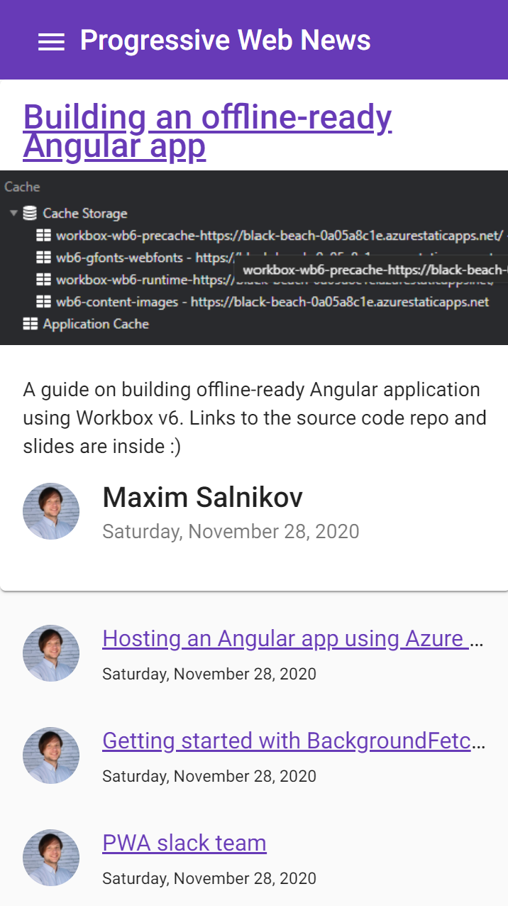

### Workshop contents

- [Intro and setting up the environment](README.md)
- [What are Progressive Web Apps (PWA). The service worker API is the backbone of PWA functionality.](theory.md)
- **Step 0 - Classic web application**
- [Step 1 - App shell with a handmade service worker](practice-step1.md)
- [Step 2 - App shell with Workbox](practice-step2.md)
- [Step 3 - Runtime caching with Workbox](practice-step3.md)
- [Step 4 - Caching missing pieces with the Workbox recipes](practice-step4.md)
- [Step 5 - Improving app update flow](practice-step5.md)
- [Step 6 - Replaying requests made offline](practice-step6.md)
- [Step 7 - Making app installable](practice-step7.md)
- [Review of other APIs to build a native-like app](other-apis.md)

# Step 0 - Classic web application

Clone the repo

```console
git clone https://github.com/webmaxru/prog-web-news
```

By default, you will have “main” branch active. Let's switch to wb-step0 branch:

```console
git checkout wb-step0
```

Install the packages

```console
npm install
```

For the local debugging, we'll use a static webserver called [Serve](https://www.npmjs.com/package/serve). It's preconfigured via `serve.json` file. Run the server

```console
npx serve
```

Alternatively, you can install and run it globally:

```console
npm install serve -g
serve
```

Open the browser
<http://localhost:5000/>

The result:


Let's check it with Lighthouse:
DevTools -> Lighthouse -> Progressive Web App -> Generate report


It could be better!

We start adding PWA features by implementing an offline-ready application shell

## Explaining the idea

An application shell is the minimal HTML, CSS, and JavaScript powering a user interface. The application shell should:

- load fast
- be cached
- dynamically display content

An application shell is a secret to reliably good performance. Think of your app's shell like the bundle of code you'd publish to an app store if you were building a native app. It's the load needed to get off the ground, but it might not be the whole story. It keeps your UI local and pulls in content dynamically through an API.

Let's define absolute minimum of the files for our application shell. In `dist\prog-web-news` folder:

- index.html
- main. * .js
- polyfills. * .js
- runtime. * .js
- styles. * .css
- assets\img\pwa-logo.png

In the next step, we'll create and register a service worker to cache and serve these resources.

## Resources and references

- <https://developers.google.com/web/updates/2015/11/app-shell>
- <https://developers.google.com/web/fundamentals/architecture/app-shell>

## If something went wrong

```console
git checkout wb-step0
```

## Next step

[Step 1 - App shell with a handmade service worker](practice-step1.md)
