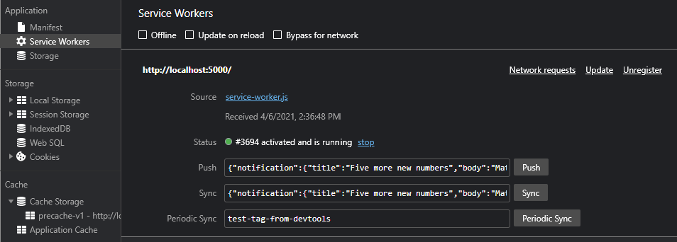
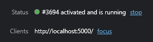
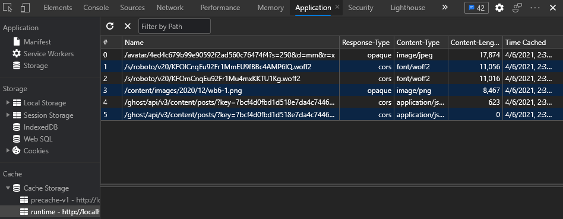
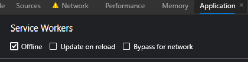
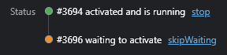
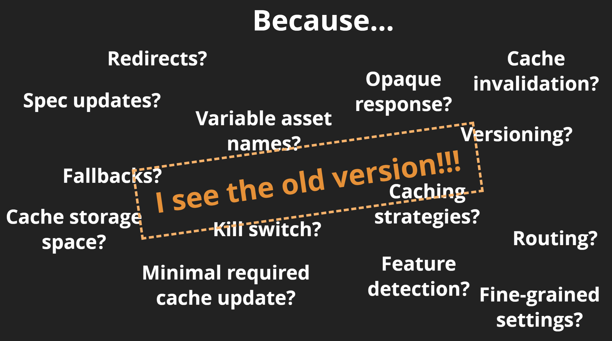

### Workshop contents

- [Intro and setting up the environment](README.md)
- [What are Progressive Web Apps (PWA). The service worker API is the backbone of PWA functionality.](theory.md)
- [Step 0 - Classic web application](practice-step0.md)
- **Step 1 - App shell with a handmade service worker**
- [Step 2 - App shell with Workbox](practice-step2.md)
- [Step 3 - Runtime caching with Workbox](practice-step3.md)
- [Step 4 - Caching missing pieces with the Workbox recipes](practice-step4.md)
- [Step 5 - Improving app update flow](practice-step5.md)
- [Step 6 - Replaying requests made offline](practice-step6.md)
- [Step 7 - Making app installable](practice-step7.md)
- [Review of other APIs to build a native-like app](other-apis.md)


# Step 1 - App shell with a handmade service worker

We want all resources for our app to be cached by the service worker, and ensure they’re sent to the page without hitting the network on subsequent visits. Service workers are very manual. They don’t provide any automation for accomplishing this goal, but they do provide a way for us to accomplish it ourselves.

:exclamation: In this step we only work with the files in `dist\prog-web-news` folder :exclamation:

## Setting up offline-ready app shell

1) Create `service-worker.js` file:

```javascript
const PRECACHE = "precache-v1";
const RUNTIME = "runtime";

const PRECACHE_URLS = [
  "index.html",
  "./",
  "main.34827f39578469476a05.js",
  "polyfills.25b2e0ae5a439ecc1193.js",
  "runtime.359d5ee4682f20e936e9.js",
  "styles.c2761edff7776e1e48a3.css",
  "assets/img/pwa-logo.png",
];

self.addEventListener("install", (event) => {
  console.log("[Service worker] Install event");
  event.waitUntil(
    caches.open(PRECACHE).then((cache) => cache.addAll(PRECACHE_URLS))
  );
});

self.addEventListener("activate", (event) => {
  console.log("[Service worker] Activate event");
  const currentCaches = [PRECACHE, RUNTIME];
  event.waitUntil(
    caches
      .keys()
      .then((cacheNames) => {
        return cacheNames.filter(
          (cacheName) => !currentCaches.includes(cacheName)
        );
      })
      .then((cachesToDelete) => {
        return Promise.all(
          cachesToDelete.map((cacheToDelete) => {
            return caches.delete(cacheToDelete);
          })
        );
      })
  );
});

self.addEventListener("fetch", (event) => {
  console.log("[Service worker] Fetch event for", event.request.url);

  // Assume that everything on app's origin is app shell
  if (event.request.url.startsWith(self.location.origin)) {
    event.respondWith(
      caches.match(event.request).then((cachedResponse) => {
        if (cachedResponse) {
          return cachedResponse;
        }
        return caches.open(PRECACHE).then((cache) => {
          return fetch(event.request).then((response) => {
            return cache.put(event.request, response.clone()).then(() => {
              return response;
            });
          });
        });
      })
    );
  } else {
    // Assume that everything outside app's origin is API or CDN
    event.respondWith(
      caches.match(event.request.clone()).then((response) => {
        return (
          response ||
          fetch(event.request.clone()).then((r2) => {
            return caches.open(RUNTIME).then((cache) => {
              cache.put(event.request.url, r2.clone());
              return r2.clone();
            });
          })
        );
      })
    );
  }
});

```

2) Add service worker registration code to `index.html` before closing `</body>` tag. The code schould be wrapped by `<script>...</script>`

```javascript
// Feature detection
if ('serviceWorker' in navigator) {

  // Postponing service worker installation until all core resources were loaded
  window.addEventListener('load', () => {

    navigator.serviceWorker.register('/service-worker.js')
      .then((registration) => {

        console.log('[App] Service worker registration succeeded:', registration);

        // If updatefound is fired, it means that there's a new service worker being installed.
        registration.addEventListener('updatefound', () => {
          
          var installingWorker = registration.installing;
          console.log('[App] A new service worker is being installed:', installingWorker);

        });
      })
      .catch((error) => {
        console.log('[App] Service worker registration failed:', error);
      });

  });
} else {
  console.log('[App] Service workers are not supported.');
}
```

3) Add a line to mimic app version changes - to `index.html` before closing `</body>` tag
```html
<div style="position: absolute; top: 23px; right: 16px; z-index: 1; color: #fff">v1</div>
```

4) Now open http://localhost:5000/


Service worker is running but not controlling the tab yet

5) Refresh the page



Now, "Clients" property appeared - service worker is fully controlling the page



Cache storage now contains both precached and runtime-cached resources

6) Switch to Offline mode (you can do it either in the application tab or in Network tab)



7) Refresh the page - offline-ready application shell is here!

## Maintaining app versions

To mimic version update do the following:

1) Iterate the number in our fake `<div>` in `index.html` 
```html
<div style="position: absolute; top: 23px; right: 16px; z-index: 1; color: #fff">v2</div>
```
2) To precache a new version we have to invoke `install` event of the service worker. Browser will call it for the updated (byte-different) service worker. In many cases the service worker will be updated because of the updated list of the resources to precache (for example if there are hashsums in the filenames). But we'll mimic it by iterating number in `const PRECACHE = "precache-v1";` after `v`.

3) Refresh the page. Again. And again. You will still see v1 in the header. Because of the service worker lifecycle, the new service worker is in waiting stage and will only replace the old one after all tabs with this application were closed.



4) Close the application tab (all tabs with this app if you have multiple ones open) and open http://localhost:5000/ again. You will see v2.

## Changing the lifecycle

It is possible to finetune the service worker lifecycle to activate itself immediately by using `self.skipWaiting()`, and to make it claim the clients (tabs) by using `self.clients.claim()`

1) Update `service-worker.js`

```javascript
self.addEventListener("install", (event) => {
  console.log("[Service worker] Install event");
  event.waitUntil(
    caches.open(PRECACHE).then((cache) => cache.addAll(PRECACHE_URLS)).then(self.skipWaiting())
  );
});

self.addEventListener("activate", (event) => {
  console.log("[Service worker] Activate event");
  const currentCaches = [PRECACHE, RUNTIME];
  event.waitUntil(
    caches
      .keys()
      .then((cacheNames) => {
        return cacheNames.filter(
          (cacheName) => !currentCaches.includes(cacheName)
        );
      })
      .then((cachesToDelete) => {
        return Promise.all(
          cachesToDelete.map((cacheToDelete) => {
            return caches.delete(cacheToDelete);
          })
        );
      })
      .then(() => self.clients.claim())
  );
});
```

2) Repeat the update application flow to make sure that all tabs closing is no longer required. But you still need 2 page refreshes to see te next version.

## Why implementing own service worker could be more complex than expected




## Resources and references

- https://developers.google.com/web/updates/2015/11/app-shell
- https://developers.google.com/web/fundamentals/architecture/app-shell
- https://developer.mozilla.org/en-US/docs/Web/API/Cache
- https://developers.google.com/web/fundamentals/getting-started/primers/service-workers?hl=en
- https://developers.google.com/web/tools/chrome-devtools/progressive-web-apps
- https://bitsofco.de/the-service-worker-lifecycle/
- https://developers.google.com/web/fundamentals/instant-and-offline/service-worker/lifecycle
- https://dbwriteups.wordpress.com/2015/11/12/service-workers-part-1-introduction/

## If something went wrong
```
git checkout wb-step1
```

## Next step
[Step 2 - App shell with Workbox](practice-step2.md)
