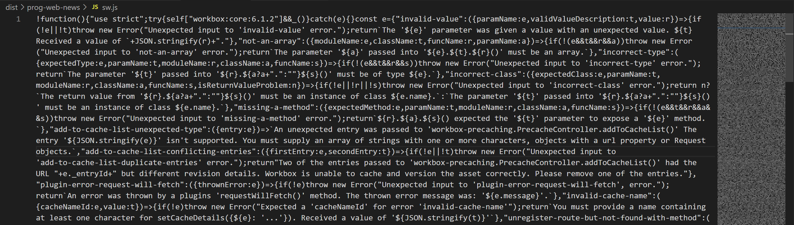
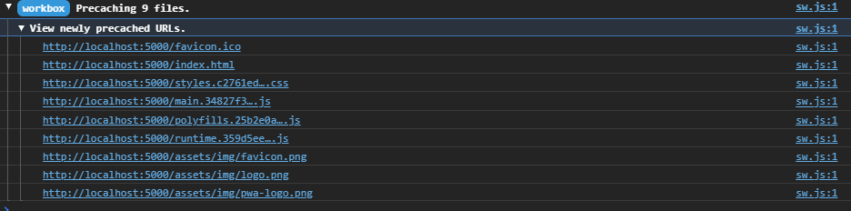
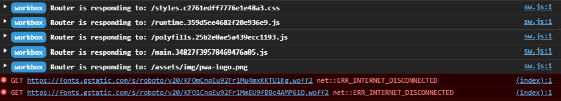
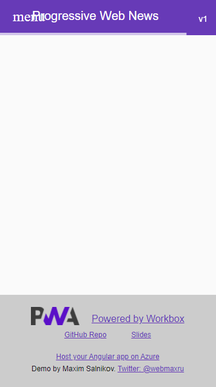
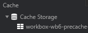

### Workshop contents

- [Intro and setting up the environment](README.md)
- [What are Progressive Web Apps (PWA). The service worker API is the backbone of PWA functionality.](theory.md)
- [Step 0 - Classic web application](practice-step0.md)
- [Step 1 - App shell with a handmade service worker](practice-step1.md)
- **Step 2 - App shell with Workbox**
- [Step 3 - Runtime caching with Workbox](practice-step3.md)
- [Step 4 - Caching missing pieces with the Workbox recipes](practice-step4.md)
- [Step 5 - Improving app update flow](practice-step5.md)
- [Step 6 - Replaying requests made offline](practice-step6.md)
- [Step 7 - Making app installable](practice-step7.md)
- [Review of other APIs to build a native-like app](other-apis.md)

# Step 2 - App shell with Workbox

[Workbox](https://developers.google.com/web/tools/workbox) is a library that bakes in a set of best practices and removes the boilerplate every developer writes when working with service workers. It's a great service worker networking tasks automation tool because of:

- Optimal level of abstraction
- Declarativeness where appropriate
- Modularity and extensibility
- Rich functionality out of the box
- Powerful tooling

It's an open-source project initiated by Google's web devrel team members and widely supported by the developer community. Workbox is a stable, production-ready, well-maintained library. Let's use it!

Workbox can me used in multiple ways:
- CLI - to generate full service worker from scratch
- Webpack plugin
- Node module

In this workshop, we focus on the last option as it's the most flexible and universal one. It works fine with application written using any framework or no framework at all. It starts with installing `workbox-build` module package but you have it installed initially. So this is just for your reference:
```
npm install workbox-build
```
This command installs not only `workbox-build` but all Workbox modules so you don't need to install them separately. Of course, only the code of the modules/methods you _actually_ use in the service worker will get to the production bundle.

### Create a _source_ service worker file
 
We will not deploy our service worker as is since now, we'll process it first (later on that) so it makes sense to keep it in `src` folder of our application.

Create `src/service-worker.js` file:

```javascript
import { precacheAndRoute } from "workbox-precaching";

// PRECACHING

// Precache and serve resources from __WB_MANIFEST array
precacheAndRoute(self.__WB_MANIFEST);
```

All we have created in the previous step (and much more!) is done in Workbox by one method - `precacheAndRoute()`. But we have to let Workbox know which files to precache - `self.__WB_MANIFEST` parameter is exactly about that. This parameter (it's an array of the objects) is not just a list of the app shell resources but also their hashsums calculated - to manage cache in a smart way. Before deploying service worker we have to _inject_ this array into `src/service-worker.js` and `workbox-build` module will help us. Since it's a Node module, let's write some Javascript code to run during the application build.

### Create Workbox precache array injection script

Create `workbox-inject.js` file in the app root folder:

```javascript
const { injectManifest } = require("workbox-build");

let workboxConfig = {
  globDirectory: "dist/prog-web-news",
  globPatterns: ["favicon.ico", "index.html", "*.css", "*.js", "assets/**/*", "offline/**/*"],
  globIgnores: [
    // Skip ES5 bundles for Angular
    "**/*-es5.*.js",
    // Config file for Azure Static Web Apps
    "assets/routes.json"
  ],

  swSrc: "src/service-worker.js",
  swDest: "dist/prog-web-news/sw.js",

  // Angular takes care of cache busting for JS and CSS (in prod mode)
  dontCacheBustURLsMatching: new RegExp(".+.[a-f0-9]{20}.(?:js|css)"),

  // By default, Workbox will not cache files larger than 2Mb (might be an issue for dev builds)
  maximumFileSizeToCacheInBytes: 4 * 1024 * 1024, // 4Mb
};

injectManifest(workboxConfig).then(({ count, size }) => {
  console.log(
    `Generated ${workboxConfig.swDest}, which will precache ${count} files, totaling ${size} bytes.`
  );
});
```

In this file, we call `injectManifest()` method with `workboxConfig` configuration to create _almost_ deployment-ready service worker `dist/prog-web-news/sw.js` from the source file `src/service-worker.js`. The [configuration options](https://developers.google.com/web/tools/workbox/reference-docs/latest/module-workbox-build#.injectManifest) are very flexible. You will easily create the precaching array you need for _your_ application even if it has a complex architecture.

### Run the injection script

```
node workbox-inject.js
```

You should see the output
```
Generated dist/prog-web-news/sw.js, which will precache 9 files, totaling 941910 bytes.
```

And `dist/prog-web-news/sw.js`file was created:
```javascript
import { precacheAndRoute } from "workbox-precaching";

// PRECACHING

// Precache and serve resources from __WB_MANIFEST array
precacheAndRoute([{"revision":"698fd10d556c218fb428b2f8913b3f36","url":"favicon.ico"},{"revision":"37606ee110a75e14c0972f9e52f16e67","url":"index.html"},{"revision":null,"url":"styles.c2761edff7776e1e48a3.css"},{"revision":null,"url":"main.34827f39578469476a05.js"},{"revision":null,"url":"polyfills.25b2e0ae5a439ecc1193.js"},{"revision":null,"url":"runtime.359d5ee4682f20e936e9.js"},{"revision":"b6f448e81e669bc05b47e542ef085ada","url":"assets/img/favicon.png"},{"revision":"f5fd664cc80a6c77d6c79e5bd2653426","url":"assets/img/logo.png"},{"revision":"33c3a22c05e810d2bb622d7edb27908a","url":"assets/img/pwa-logo.png"}]);
```

### Bundling and minifying a service worker

We need some more processing of the service worker file before the deployment: now, we have to bundle it because ES6 imports are not yet supported in service workers. But having this step brings an extra benefit - by bundling we cherry-pick only the code for the methods we _actually use_ from Workbox modules to deploy to production. Also, we'll use [Terser](https://github.com/terser/terser) (as a plugin) to minify the service worker code to follow the modern web development practices.

You can [use your favorite bundler](https://developers.google.com/web/tools/workbox/guides/using-bundlers) for this task. In this workshop, we'll use Rollup with some plugins. They are already installed for you, so this command is just for your reference:
```
npm install rollup, rollup-plugin-node-resolve, rollup-plugin-replace, rollup-plugin-terser
```

Create a Rollup configuration file `rollup.config.js` in the application root folder:

```javascript
import resolve from 'rollup-plugin-node-resolve'
import replace from 'rollup-plugin-replace'
import { terser } from 'rollup-plugin-terser'

export default {
  input: 'dist/prog-web-news/sw.js',
  output: {
    file: 'dist/prog-web-news/sw.js',
    format: 'iife'
  },
  plugins: [
    resolve(),
    replace({
      'process.env.NODE_ENV': JSON.stringify('development')
    }),
    terser()
  ]
}
```

To test, run the command
```
npx rollup -c
```

Now, `dist/prog-web-news/sw.js` looks like we want and ready for deployment:


❗ We intentionally generated a _development_ build of Workbox service worker to have an extensive logging in the console. For the production build (no logging, smaller bundle) replace `JSON.stringify('development')` with `JSON.stringify('production')`.

It's very important to strictly follow the steps order:
1) Application build. For example, by the framework (we don't run this step in this workshop, a built version checked into the `dist` folder for us)
2) Precaching list injection
3) Service worker bundling

Finally, we can integrate all these steps into the overall application build by creating the corresponding commands in `package.json`:
```
"scripts": {
    "ng": "ng",
    "start": "ng serve",
    "build": "npm run build-pwa",
    "test": "ng test",
    "lint": "ng lint",
    "e2e": "ng e2e",
    "build-sw": "node workbox-inject.js && npx rollup -c",
    "build-pwa": "ng build --prod && npm run build-sw"
  },
```

- By running `npm run build-sw` we'll generate a ready-to-go service worker. We'll call this **"rebuld service worker"** and use it often in this workshop)
- By running `npm run build-pwa` we'll build a full application including service worker (we will not use this command in this workshop)

### Build a service worker and test the application

Run the command

```
npm run build-sw
```

Our service worker file name is `sw.js` now, so update the registration in `index.html` to:

```javascript
navigator.serviceWorker.register('/sw.js')
```

Open http://localhost:5000/

❗ Before further testing don't forget to "Clear site data" ❗ 

Workbox provides detailed logging:


Switch to offline mode and refresh a page to make sure the application shell was properly cached. Workbox serves the precached resources:


But neither API (blog posts) nor CDN (fonts, font icons, avatars) data yet - we'll fix it in the next steps!


### Fixing single page application routing

Our app is a classic SPA where a webserver (called "Serve" in our case) redirects to `index.html` all navigation requests without corresponding resources deployed. And then Javascript-based router (Angular's in our case) decides which component to load and render.

Open http://localhost:5000/about url - it works fine. Now switch offline mode and reload the page. The direct url http://localhost:5000/about will not work while opening http://localhost:5000/ and picking "About" from menu works fine. The issue is: Workbow knows nothing about `/about` url (and all other urls which we didn't list explicitly in the array of the resources to precache). What if we mimic the webserver behaviour and serve `index.html` for "unknown" urls and let the application router decide what to do? Luckily, there is a special method in Workbox to fix it.

1) Update `service-worker.js`:

```javascript
import { precacheAndRoute, createHandlerBoundToURL } from "workbox-precaching";
import { NavigationRoute, registerRoute } from "workbox-routing";

// PRECACHING

// Precache and serve resources from __WB_MANIFEST array
precacheAndRoute(self.__WB_MANIFEST);

// NAVIGATION ROUTING

// This assumes /index.html has been precached.
const navHandler = createHandlerBoundToURL("/index.html");
const navigationRoute = new NavigationRoute(navHandler, {
  denylist: [new RegExp("/out-of-spa/")], // Also might be specified explicitly via allowlist
});
registerRoute(navigationRoute);
```

In this code, by using `denylist` here we want to illustrate the way to exclude a particular url pattern from SPA navigation - it might be useful in some scenarios.

2) Rebuild service worker

3) Open http://localhost:5000/ in online mode, switch to offline and open http://localhost:5000/about. It should work now!

### Some extra housekeeping

Let's add couple more functionality pieces to your service worker:
- To illustrate some configuration possibilities, let's give custom names to our caches
- To simplify service worker lifecycle, let's claim the clients (tabs) as soon as possible and skip activation waiting

1) Add to `service-worker.js`:

```javascript
import { setCacheNameDetails, clientsClaim } from "workbox-core";

// SETTINGS

// Claiming control to start runtime caching asap
clientsClaim();

// Use to update the app after user triggered refresh
self.skipWaiting();

// Setting custom cache names
setCacheNameDetails({ precache: "wb6-precache", runtime: "wb6-runtime" });
```

2) Rebuild service worker

3) Open http://localhost:5000/ and look at the cache name:



## Resources and references

- https://developers.google.com/web/tools/workbox/guides/configure-workbox
- https://developers.google.com/web/tools/workbox/modules/workbox-precaching
- https://developers.google.com/web/tools/workbox/modules/workbox-build


## If something went wrong
```
git checkout wb-step2
```

## Next step
[Step 3 - Runtime caching with Workbox](practice-step3.md)
