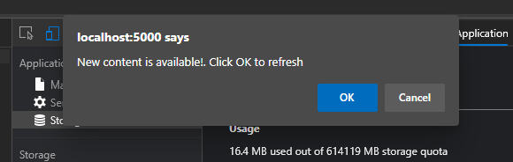
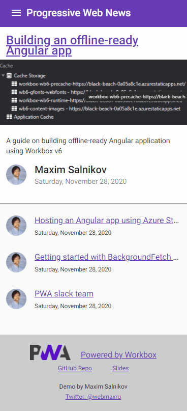

### Workshop contents

- [Intro and Setting up the environment](README.md)
- [What are Progressive Web Apps (PWA). The service worker API is the backbone of PWA functionality.](theory.md)
- [Step 0 - Classic web application](practice-step0.md)
- [Step 1 - App shell with a handmade service worker](practice-step1.md)
- [Step 2 - App shell with Workbox](practice-step2.md)
- [Step 3 - Runtime caching with Workbox](practice-step3.md)
- [Step 4 - Caching missing pieces with the Workbox recipes](practice-step4.md)
- **Step 5 - Improving app update flow**
- [Step 6 - Replaying requests made offline](practice-step6.md)
- [Step 7 - Making app installable](practice-step7.md)
- [Review of other APIs to build a native-like app](other-apis.md)

# Step 5 - Improving app update flow

Let's go back to the application shell versioning and make this process interactive. To have a handy hook for the moment when it's time to display a prompt in our application code, we'll change the service worker registration code from the native to the one offered by `workbox-window` module.

1) In `index.html` replace the whole service worker registration code to this one wrapped by `<script type="module">...</script>`:
```
import {Workbox} from 'https://storage.googleapis.com/workbox-cdn/releases/6.1.2/workbox-window.prod.mjs';

// Feature detection
if ('serviceWorker' in navigator) {

  const wb = new Workbox('/sw.js');

  // Add an event listener to detect when the registered
  // service worker has installed but is waiting to activate.
  wb.addEventListener('waiting', () => {
    // Displaying prompt
    if (confirm(`New content is available!. Click OK to refresh`)) {
      
      // Assuming the user accepted the update, set up a listener
      // that will reload the page as soon as the previously waiting
      // service worker has taken control.
      wb.addEventListener('controlling', () => {
        window.location.reload();
      });

      // This will postMessage() to the waiting service worker.
      wb.messageSkipWaiting();
    }
  });

  wb.register()
    .then((reg) => {
      console.log('Successful service worker registration', reg);
    })
    .catch((err) =>
      console.error('Service worker registration failed', err)
    );

} else {
  console.log('[App] Service workers are not supported.');
}
```

❗ We use this non-production ready way to use `workbox-window` module only because we don't want to rebuild the application itself furing the workshop. In the real life, you will use it like `import { Workbox } from 'workbox-window';` in your application code to apply a bundler later. See [example for Angular](https://github.com/webmaxru/prog-web-news/blob/main/src/app/app-shell/app-shell.component.ts#L32).

2) In `service-worker.js` add the listener
```javascript
// APP SHELL UPDATE FLOW

addEventListener("message", (event) => {
  if (event.data && event.data.type === "SKIP_WAITING") {
    self.skipWaiting();
  }
});
```

and disable `skipWaiting()`

```javascript
// Use to update the app after user triggered refresh
//self.skipWaiting();
```

3) Rebuild service worker

4) Open http://localhost:5000

### How to test the interactive update flow

We have to mimic the application update - we'll use our fake div with "v1" again.

1) Change the v1 to something else in `index.html`
```html
<div style="position: absolute; top: 23px; right: 16px; z-index: 1; color: #fff">v2</div>
```

2) Rebuild service worker

3) Reload the page (we pretend that the user haven't visited the website for a while and there is a new version was deployed between this and previous visit). You will see the prompt to reload the page one more time to see the updated version:



❗ Using native Javascript `confirm()` method is not a best practice - this modal dialogue breaks the user experience. We use it only for the sake of simplicity. Normally, you will use some subtle, non obtrusive, dismissable UI compoment from your app's design system. Example for Angular material:




## Resources and references

- https://developers.google.com/web/tools/workbox/modules/workbox-window
- https://developers.google.com/web/tools/workbox/guides/advanced-recipes#offer_a_page_reload_for_users

## If something went wrong
```
git checkout wb-step5
```

## Next step
[Step 6 - Replaying requests made offline](practice-step6.md)
