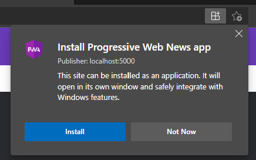
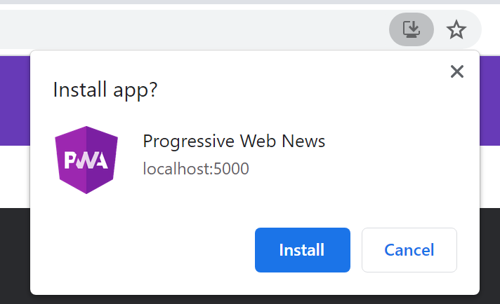
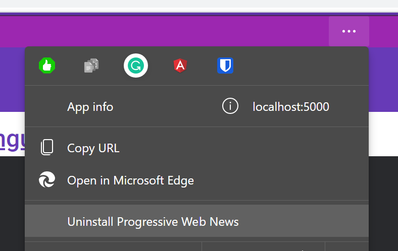
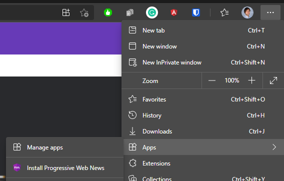
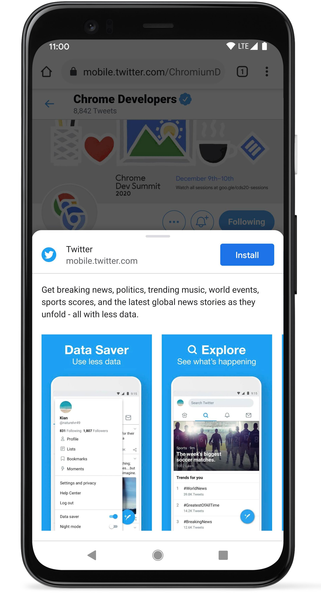
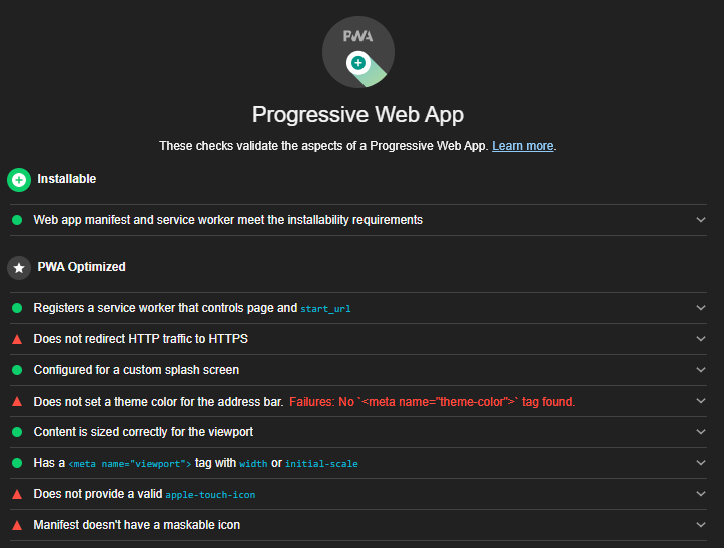
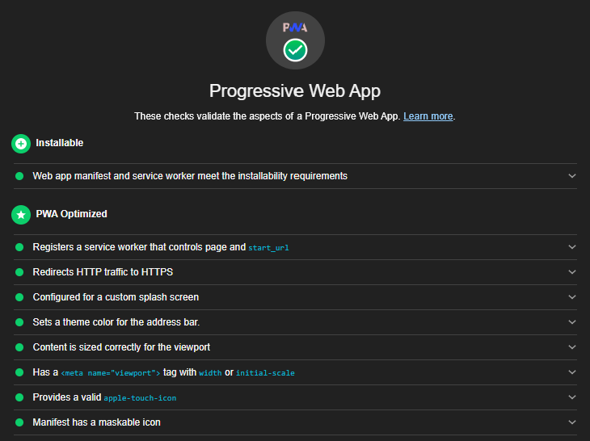

### Workshop contents

- [Intro and Setting up the environment](README.md)
- [What are Progressive Web Apps (PWA). The service worker API is the backbone of PWA functionality.](theory.md)
- [Step 0 - Classic web application](practice-step0.md)
- [Step 1 - App shell with a handmade service worker](practice-step1.md)
- [Step 2 - App shell with Workbox](practice-step2.md)
- [Step 3 - Runtime caching with Workbox](practice-step3.md)
- [Step 4 - Caching missing pieces with the Workbox recipes](practice-step4.md)
- [Step 5 - Improving app update flow](practice-step5.md)
- [Step 6 - Replaying requests made offline](practice-step6.md)
- **Step 7 - Making app installable**
- [Review of other APIs to build a native-like app](other-apis.md)

# Step 7 - Making app installable

App Manifest enables features such as add to home screen and splash screens. Manifest files are supported in Chrome, Edge, Firefox, UC Browser, Opera, and the Samsung browser. Safari has partial support.

### Creating and validating Web App Manifest

1) Generate icons and a manifest template using one of the online services. We'll use https://manifest-gen.netlify.app/. Parameters:
- App Name: Progressive Web News
- Short Name: Prog Web News
- Theme Color: #9c27b0
- Background Color: #fafafa
- Display Mode: standalone
- Use this image as a source for the icons: https://raw.githubusercontent.com/webmaxru/prog-web-news/wb-step0/src/assets/img/favicon.png
3) Copy the images from archive you received to `dist/prog-web-news/assets/icons` folder
4) In the archive you will also find `manifest.json` file. Based on it, we'll create a file called `app.webmanifest` (using this extension to follow the specification) and put it into `dist/prog-web-news/assets` folder:
```json
{
  "name": "Progressive Web News",
  "short_name": "Prog Web News",
  "theme_color": "#9c27b0",
  "background_color": "#fafafa",
  "display": "standalone",
  "orientation": "portrait",
  "scope": "/",
  "start_url": "/",
  "icons": [
    {
      "src": "icons/icon-72x72.png",
      "sizes": "72x72",
      "type": "image/png"
    },
    {
      "src": "icons/icon-96x96.png",
      "sizes": "96x96",
      "type": "image/png"
    },
    {
      "src": "icons/icon-128x128.png",
      "sizes": "128x128",
      "type": "image/png"
    },
    {
      "src": "icons/icon-144x144.png",
      "sizes": "144x144",
      "type": "image/png"
    },
    {
      "src": "icons/icon-152x152.png",
      "sizes": "152x152",
      "type": "image/png"
    },
    {
      "src": "icons/icon-192x192.png",
      "sizes": "192x192",
      "type": "image/png"
    },
    {
      "src": "icons/icon-384x384.png",
      "sizes": "384x384",
      "type": "image/png"
    },
    {
      "src": "icons/icon-512x512.png",
      "sizes": "512x512",
      "type": "image/png"
    }
  ]
}
```
4) Add manifest linking code to the `<head>` block of `index.html`:
```html
<link rel='manifest' href='/assets/app.webmanifest'>
```
5) Open http://localhost:5000/ and open Dev Tools -> Application -> Manifest tab to check if everything looks correctly.

### Web app installation

Now, our web app meets [installability criteria](https://web.dev/install-criteria/) for at least Chromium-based browsers. In the right of the address bar you will find an icon button to install it. In Microsoft Edge:



In Google Chrome:



After you install the application, it will work in the separate window. You can uninstall it from the context menu placed in the title bar of this window:



There is also an alternative way to install the application - with using the browser menu:



### Improved installation dialogue

Soon, it will become possible to use extra fields of the Web App Manifest to improve the user experience: `description` and `screenshots`. [Currently](https://twitter.com/ChromiumDev/status/1376472636058927104), these fields are in use only in Chrome for Android. The experimental flag chrome://flags/#mobile-pwa-install-use-bottom-sheet flag must be enabled in Chrome 90. This experience will come to the desktops also.



### Fixing last details of the Lighthouse audit

If we generate PWA report now, we'll see the following:



Let's fix the missing parts.

1) To support the address bar theming in Android-based browsers we have to provide one more meta tag in the `<head>` of `index.html`. We'll use the color from `theme_color` property of Web App Manifest:
```html
<meta name="theme-color" content="#9c27b0"/>
```
2) When iOS Safari users add PWAs to their home screens, the icon that appears is called the Apple touch icon. We have to specify what icon your app should use by including one more property to the `<head>` of `index.html`:
```html
<link rel="apple-touch-icon" href="/assets/icons/icon-192x192.png">
```
3) To make sure our icon looks great on newer Android devices (without white background added), we have to mark one icon as [maskable](https://web.dev/maskable-icon-audit/) by adding `purpose` property equals `any maskable`. In `app.webmanifest` edit:
```json
{
  "src": "icons/icon-144x144.png",
  "sizes": "144x144",
  "type": "image/png",
  "purpose": "any maskable"
},
```
 
4) (Optionally) To fix `http`->`https` redirect, we have to deploy our application to the static web apps hosting which supports this feature. For example, [Azure Static Web Apps]()

The final report will look perfect:



## Resources and references

- https://developer.mozilla.org/en-US/docs/Web/Manifest
- https://web.dev/add-manifest/
- https://developers.google.com/web/fundamentals/app-install-banners/promoting-install-mobile
- https://www.dunplab.it/web-app-manifest-generator (alternative Web App Manifest generator)
- https://www.pwabuilder.com/ Web App Manifest and Service Worker generator by Microsoft
- https://web.dev/maskable-icon/
- https://web.dev/install-criteria/


## If something went wrong
```
git checkout wb-step7
```

## Next step
[Review of other APIs to build a native-like app](other-apis.md)
