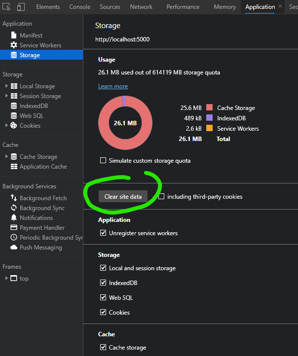
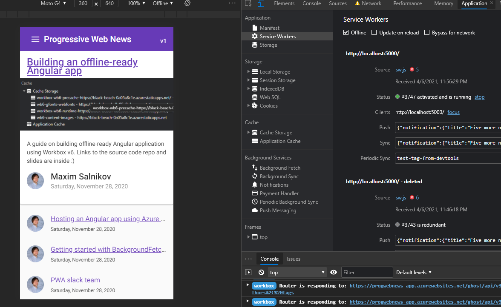
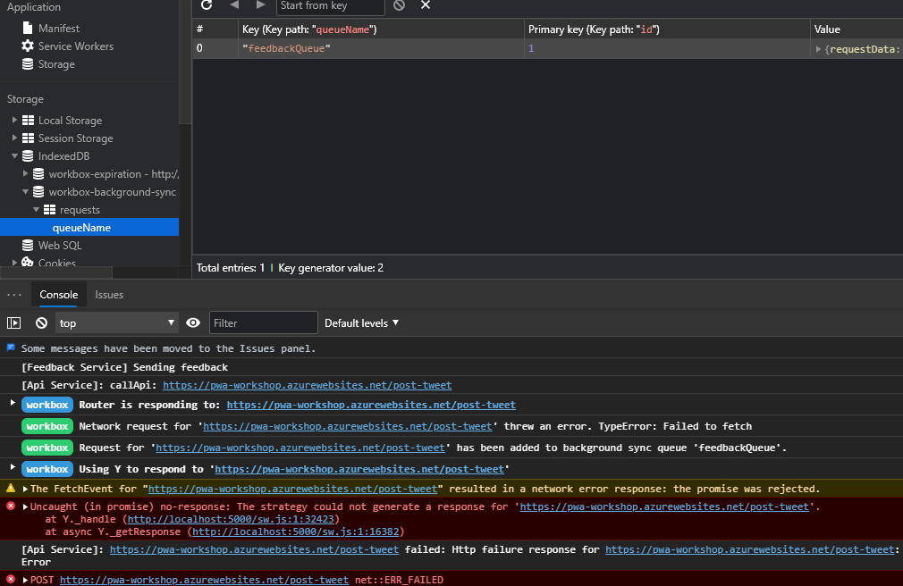
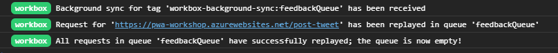
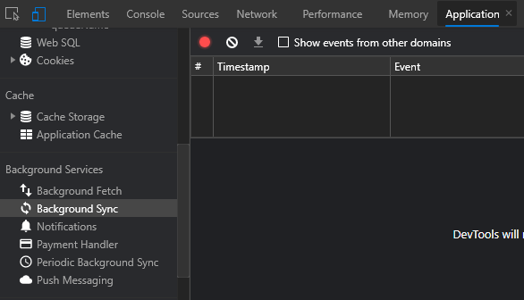
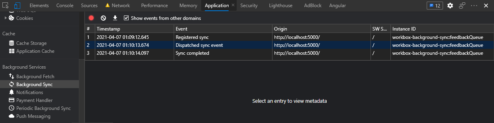

# PWA Workshop, 2021 edition

## Workshop contents

- Intro and setting up the environment**
- What are Progressive Web Apps (PWA). The service worker API is the backbone of PWA functionality.
- Step 0 - Classic web application
- Step 1 - App shell with a handmade service worker
- Step 2 - App shell with Workbox
- Step 3 - Runtime caching with Workbox
- Step 4 - Caching missing pieces with the Workbox recipes
- Step 5 - Improving app update flow
- Step 6 - Replaying requests made offline
- Step 7 - Making app installable
- Review of other APIs to build a native-like app

The web platform is versatile, capable, and can go far beyond the browser tab while keeping its open and universal nature. We call “progressive” the web apps built using the latest browser APIs to achieve a new level of user experience. In this framework-agnostic workshop, we'll convert a “classic” web application to progressive using Workbox 6 - the latest version of the service worker automation library. So you can do the same with an app you or your company is developing now!

### During this hands-on task-based training, you will learn about

- Progressive Web App concept pillars
- Service Worker API fundamentals
- Current PWA support by different platforms (and workarounds when needed)
- Workbox library - an industry-standard in the automation of network-related PWA tasks

### On the practical side, every participant will build an app which is:

- Installable on all modern desktop and mobile operating systems
- Offline-ready: the app itself, smart caching strategies for the data it consumes, and network-resilient data sending
- Ready for being extended by the next PWA features coming to the web
- Following the modern web development flows for building a service worker
- Also, I share lots of practical tips & tricks, both technical and UX, review real-life PWA examples, explain how to avoid common pitfalls, and how to deal with edge cases.

### Expected level

- Basic knowledge of JavaScript is required
- The knowledge of any framework(s) is not required

## Your trainer: Maxim Salnikov


### Developer Engagement Lead at Microsoft

Maxim Salnikov is an Oslo-based cloud and web front-end geek with a strong passion for developer community building. He architects and builds complex web applications since the end of the last century, and has extensive experience with all aspects of the web platform, focusing on apps managing real-time data from IoT devices, and Progressive Web Apps. He is a Google Developer Expert in Web Technologies & IoT, and a former Microsoft MVP in Development Technologies.

Maxim is a founder and active contributor to two conferences: Mobile Era and ngVikings - Nordics' main conferences for mobile and Angular developers respectively. Also, he leads Norway's largest meetups dedicated to web front-end and mobile: Angular Oslo, Mobile Meetup, Oslo PWA, Framsia.

Maxim is passionate about sharing his web platform experience and knowledge with the community. He travels extensively for visiting developer events and speaking/training at conferences and meetups around the world.

Invite me to speak at your event using this form: <http://bit.ly/maxim-salnikov-speaker-request>

## Schedule

- 11:00 AM - 12:30 PM - Session 1
- 12:30 PM - 12:45 PM - 15 minutes break
- 12:45 - 2:15 PM - Session 2
- 2:15 - 2:45 PM - 30 minutes break
- 2:45 - 4:15 PM - Session 3
- 4:15 - 4:30 PM - 15 minutes break
- 4:30 - 6:00 PM - Session 4

## Content

### Session 1

- Setting up the environment
- What are Progressive Web Apps (PWA)
- The service worker API is the backbone of PWA functionality
- Step 0 - Classic web application
- Step 1 - App shell with a handmade service worker

### Session 2

- Step 2 - App shell with Workbox
- Step 3 - Runtime caching with Workbox
- Step 4 - Caching missing pieces with the Workbox recipes

### Session 3

- Step 5 - Improving app update flow
- Step 6 - Replaying requests made offline

### Session 4

- Step 7 - Making app installable
- Review of other APIs to build a native-like app
- Questions and answers

---

## Setting up the environment

### Tools and browsers

We need a PC or Mac with installed (latest stable versions):

- Git
- Node
- NPM

Browsers (latest stable versions):

- Browsers Chrome and / or Edge, optionally - Firefox

Good to have:

- Canary versions of Chrome and / or Edge

### Front-end stack description

We will use a simple blog application written in Angular. Production builds will be provided for each step, so there is no need to set up Angular infrastructure (but it's possible to set up the full build, if you wish). We will run some simple commands using npm scripts.

### Backend stack description

We will use a hosted Ghost engine as a backend.

### Using Lighthouse - our main metric of app's progressiveness

Lighthouse analyzes web apps and web pages, collecting modern performance metrics and insights on developer best practices.

<https://github.com/GoogleChrome/lighthouse>

There are two options:

- As of version 60 Chromium engine now has a built-in lighthouse test which is accessible on the Audits tab of the developer tools. DevTools -> Lighthouse -> PWA -> Generate report
- CLI tool

```console
npm install -g lighthouse
lighthouse https://airhorner.com --view
```

The `--view` parameter will open the resulting report in a new browser window.

Test some websites using Lighthouse:

- <https://airhorner.com/>
- <https://smashingmagazine.com>
- Your company's website?

## Practical part

The practical part of the workshop consists of modernizing the front-end part of a web application from a "regular" one to a PWA. To make the project realistic, the application was built using of the popular front-end frameworks (Angular), but knowledge of this framework and its specific tools is not required: all the necessary builds will be provided. In addition, all the techniques, methods, practices studied in the workshop, and the code from the examples is applicable to any web application. During the practical part, the following functionality will be added to the application:

- Offline readiness of the application shell
- Caching responses from API and CDN using appropriate strategies
- Interactive version upgrade process
- Preserving data submitted by the user in offline mode for auto-resending it to the backend after getting internet connectivity
- Installing the app on devices

# What are Progressive Web Apps (PWA). The service worker API is the backbone of PWA functionality

Putting aside the marketing component of this popular term, let's look at the technical details: what exactly makes an application progressive and why PWA can be a new era in the development of the web.

- Prerequisites for the occurrence
- Formal definition
- Benefits for users and developers
- Opportunities and installation of a web application are the two main vectors of PWA development
- Current state of the art with support across platforms, operating systems, and browsers

Most of the capabilities of progressive web applications are implemented using the Service Worker API. To understand what exactly we will automate using Workbox, we will study the basic ideas of this API and write a service worker ourselves.

- Similarities and differences with other browser workers
- Service worker life cycle
- Main events
- Registration in the application
- Debugging in the browser

## Resources and references

- <https://slides.com/webmax/introducing-pwa/>

# Step 0 - Classic web application

Clone the repo

```console
git clone https://github.com/webmaxru/prog-web-news
```

By default, you will have “main” branch active. Let's switch to wb-step0 branch:

```console
git checkout wb-step0
```

Install the packages

```console
npm install
```

For the local debugging, we'll use a static webserver called [Serve](https://www.npmjs.com/package/serve). It's preconfigured via `serve.json` file. Run the server

```console
npx serve
```

Alternatively, you can install and run it globally:

```console
npm install serve -g
serve
```

Open the browser
<http://localhost:5000/>

The result:


Let's check it with Lighthouse:
DevTools -> Lighthouse -> Progressive Web App -> Generate report


It could be better!

We start adding PWA features by implementing an offline-ready application shell

## Explaining the idea

An application shell is the minimal HTML, CSS, and JavaScript powering a user interface. The application shell should:

- load fast
- be cached
- dynamically display content

An application shell is a secret to reliably good performance. Think of your app's shell like the bundle of code you'd publish to an app store if you were building a native app. It's the load needed to get off the ground, but it might not be the whole story. It keeps your UI local and pulls in content dynamically through an API.

Let's define absolute minimum of the files for our application shell. In `dist\prog-web-news` folder:

- index.html
- main. * .js
- polyfills. * .js
- runtime. * .js
- styles. * .css
- assets\img\pwa-logo.png

In the next step, we'll create and register a service worker to cache and serve these resources.

## Resources and references

- <https://developers.google.com/web/updates/2015/11/app-shell>
- <https://developers.google.com/web/fundamentals/architecture/app-shell>

## If something went wrong

```console
git checkout wb-step0
```

# Step 1 - App shell with a handmade service worker

We want all resources for our app to be cached by the service worker and ensure they're sent to the page without hitting the network on subsequent visits. Service workers are very manual. They don't provide any automation for accomplishing this goal, but they do provide a way for us to accomplish it ourselves.

:exclamation: In this step, we only work with the files in `dist\prog-web-news` folder :exclamation:

## Setting up offline-ready app shell

1) Create `service-worker.js` file:

```javascript
const PRECACHE = "precache-v1";
const RUNTIME = "runtime";

const PRECACHE_URLS = [
  "index.html",
  "./",
  "main.34827f39578469476a05.js",
  "polyfills.25b2e0ae5a439ecc1193.js",
  "runtime.359d5ee4682f20e936e9.js",
  "styles.c2761edff7776e1e48a3.css",
  "assets/img/pwa-logo.png",
];

self.addEventListener("install", (event) => {
  console.log("[Service worker] Install event");
  event.waitUntil(
    caches.open(PRECACHE).then((cache) => cache.addAll(PRECACHE_URLS))
  );
});

self.addEventListener("activate", (event) => {
  console.log("[Service worker] Activate event");
  const currentCaches = [PRECACHE, RUNTIME];
  event.waitUntil(
    caches
      .keys()
      .then((cacheNames) => {
        return cacheNames.filter(
          (cacheName) => !currentCaches.includes(cacheName)
        );
      })
      .then((cachesToDelete) => {
        return Promise.all(
          cachesToDelete.map((cacheToDelete) => {
            return caches.delete(cacheToDelete);
          })
        );
      })
  );
});

self.addEventListener("fetch", (event) => {
  console.log("[Service worker] Fetch event for", event.request.url);

  // Assume that everything on app's origin is app shell
  if (event.request.url.startsWith(self.location.origin)) {
    event.respondWith(
      caches.match(event.request).then((cachedResponse) => {
        if (cachedResponse) {
          return cachedResponse;
        }
        return caches.open(PRECACHE).then((cache) => {
          return fetch(event.request).then((response) => {
            return cache.put(event.request, response.clone()).then(() => {
              return response;
            });
          });
        });
      })
    );
  } else {
    // Assume that everything outside app's origin is API or CDN
    event.respondWith(
      caches.match(event.request.clone()).then((response) => {
        return (
          response ||
          fetch(event.request.clone()).then((r2) => {
            return caches.open(RUNTIME).then((cache) => {
              cache.put(event.request.url, r2.clone());
              return r2.clone();
            });
          })
        );
      })
    );
  }
});

```

2) Add service worker registration code to `index.html` before the closing `</body>` tag. The code should be wrapped by `<script>...</script>`

```javascript
// Feature detection
if ('serviceWorker' in navigator) {

  // Postponing service worker installation until all core resources were loaded
  window.addEventListener('load', () => {

    navigator.serviceWorker.register('/service-worker.js')
      .then((registration) => {

        console.log('[App] Service worker registration succeeded:', registration);

        // If updatefound is fired, it means that there's a new service worker being installed.
        registration.addEventListener('updatefound', () => {
          
          var installingWorker = registration.installing;
          console.log('[App] A new service worker is being installed:', installingWorker);

        });
      })
      .catch((error) => {
        console.log('[App] Service worker registration failed:', error);
      });

  });
} else {
  console.log('[App] Service workers are not supported.');
}
```

3) Add a line to mimic app version changes - to `index.html` before closing `</body>` tag

```html
<div style="position: absolute; top: 23px; right: 16px; z-index: 1; color: #fff">v1</div>
```

4) Now, open <http://localhost:5000/>


The service worker is running but not controlling the tab yet

5) Refresh the page


Now, "Clients" property appeared - service worker is fully controlling the page


Cache storage now contains both precached and runtime-cached resources

6) Switch to Offline mode (you can do it either in the application tab or in the Network tab)


7) Refresh the page - offline-ready application shell is here!

## Maintaining app versions

To mimic version update, do the following:

1) Iterate the number in our fake `<div>` in `index.html`

```html
<div style="position: absolute; top: 23px; right: 16px; z-index: 1; color: #fff">v2</div>
```

2) To precache a new version, we have to invoke `install` event of the service worker. The browser will call it for the updated (byte-different) service worker. In many cases, the service worker will be updated because of the updated list of the resources to precache (for example, if there are hashsums in the filenames). But we'll mimic it by iterating the number in `const PRECACHE = "precache-v1";` after `v`.

3) Refresh the page. Again. And again. You will still see v1 in the header. Because of the service worker lifecycle, the new service worker is in the waiting stage and will only replace the old one after all tabs with this application were closed.


4) Close the application tab (all tabs with this app if you have multiple ones open) and open <http://localhost:5000/> again. You will see v2.

❗❗❗ IMPORTANT ❗❗❗

During this workshop, you will need to start a "new life" of the application (including its service worker) many-many-many times. Before each new iteration, go to the Dev Tools -> Application -> Storage and click "Clear site data" with all checkboxes below checked.



## Changing the lifecycle

It is possible to finetune the service worker lifecycle to activate itself immediately by using `self.skipWaiting()`, and to make it claim the clients (tabs) by using `self.clients.claim()`

1) Update `service-worker.js`

```javascript
self.addEventListener("install", (event) => {
  console.log("[Service worker] Install event");
  event.waitUntil(
    caches.open(PRECACHE).then((cache) => cache.addAll(PRECACHE_URLS)).then(self.skipWaiting())
  );
});

self.addEventListener("activate", (event) => {
  console.log("[Service worker] Activate event");
  const currentCaches = [PRECACHE, RUNTIME];
  event.waitUntil(
    caches
      .keys()
      .then((cacheNames) => {
        return cacheNames.filter(
          (cacheName) => !currentCaches.includes(cacheName)
        );
      })
      .then((cachesToDelete) => {
        return Promise.all(
          cachesToDelete.map((cacheToDelete) => {
            return caches.delete(cacheToDelete);
          })
        );
      })
      .then(() => self.clients.claim())
  );
});
```

2) Repeat the update application flow to make sure that all tabs closing is no longer required. But you still need two page refreshes to see the next version.

## Why implementing own service worker could be more complex than expected


## Resources and references

- <https://developer.mozilla.org/en-US/docs/Web/API/Cache>
- <https://developers.google.com/web/fundamentals/getting-started/primers/service-workers?hl=en>
- <https://developers.google.com/web/tools/chrome-devtools/progressive-web-apps>
- <https://bitsofco.de/the-service-worker-lifecycle/>
- <https://developers.google.com/web/fundamentals/instant-and-offline/service-worker/lifecycle>
- <https://dbwriteups.wordpress.com/2015/11/12/service-workers-part-1-introduction/>

## If something went wrong

```console
git checkout wb-step1
```

# Step 2 - App shell with Workbox

After getting acquainted with the API of the service worker, we realized that to implement even the basic offline readiness of the application, a fairly wide range of knowledge and skills of working with service workers and not only is required. The [Workbox](https://developers.google.com/web/tools/workbox) library provides a comfortable abstraction layer for automating common network tasks for service workers. It also contains a set of best practices and removes the boilerplate every developer writes when working with service workers.

Workbox is a great service worker networking tasks automation tool because of:

- Optimal level of abstraction
- Declarativeness where appropriate
- Modularity and extensibility
- Rich functionality out of the box
- Powerful tooling

It's an open-source project initiated by Google web developer relations team members and widely supported by the developer community. Workbox is a stable, production-ready, well-maintained library. Let's use it!

Workbox can be used in multiple ways:

- CLI - to generate a full service worker from scratch
- Webpack plugin
- Node module

In this workshop, we focus on the last option as it's the most flexible and universal one. It works fine with an application written using any framework or no framework at all. It starts with installing `workbox-build` module package, but you have it installed initially. So this is just for your reference:

```console
npm install workbox-build
```

This command installs not only `workbox-build` but all Workbox modules, so you don't need to install them separately. Of course, only the code of the modules/methods you _actually_ use in the service worker will get to the production bundle.

## Create a _source_ service worker file

We will not deploy our service worker as is since now, we'll process it first (later on that) so it makes sense to keep it in `src` folder of our application.

Create `src/service-worker.js` file:

```javascript
import { precacheAndRoute } from "workbox-precaching";

// PRECACHING

// Precache and serve resources from __WB_MANIFEST array
precacheAndRoute(self.__WB_MANIFEST);
```

All we have created in the previous step (and much more!) is done in Workbox by one method - `precacheAndRoute()`. But we have to let Workbox know which files to precache - `self.__WB_MANIFEST` parameter is exactly about that. This parameter (it's an array of the objects) is not just a list of the app shell resources but also their hashsums calculated - to manage cache in a smart way. Before deploying service worker, we have to _inject_ this array into `src/service-worker.js` and `workbox-build` module will help us. Since it's a Node module, let's write some Javascript code to run during the application build.

### Create Workbox precache array injection script

Create `workbox-inject.js` file in the app root folder:

```javascript
const { injectManifest } = require("workbox-build");

let workboxConfig = {
  globDirectory: "dist/prog-web-news",
  globPatterns: ["favicon.ico", "index.html", "*.css", "*.js", "assets/**/*", "offline/**/*"],
  globIgnores: [
    // Skip ES5 bundles for Angular
    "**/*-es5.*.js",
    // Config file for Azure Static Web Apps
    "assets/routes.json"
  ],

  swSrc: "src/service-worker.js",
  swDest: "dist/prog-web-news/sw.js",

  // Angular takes care of cache busting for JS and CSS (in prod mode)
  dontCacheBustURLsMatching: new RegExp(".+.[a-f0-9]{20}.(?:js|css)"),

  // By default, Workbox will not cache files larger than 2Mb (might be an issue for dev builds)
  maximumFileSizeToCacheInBytes: 4 * 1024 * 1024, // 4Mb
};

injectManifest(workboxConfig).then(({ count, size }) => {
  console.log(
    `Generated ${workboxConfig.swDest}, which will precache ${count} files, totaling ${size} bytes.`
  );
});
```

In this file, we call `injectManifest()` method with `workboxConfig` configuration to create _almost_ deployment-ready service worker `dist/prog-web-news/sw.js` from the source file `src/service-worker.js`. The [configuration options](https://developers.google.com/web/tools/workbox/reference-docs/latest/module-workbox-build#.injectManifest) are very flexible. You will easily create the precaching array you need for _your_ application, even if it has a complex architecture.

### Run the injection script

```console
node workbox-inject.js
```

You should see the output

```console
Generated dist/prog-web-news/sw.js, which will precache 9 files, totaling 941910 bytes.
```

And `dist/prog-web-news/sw.js`file was created:

```javascript
import { precacheAndRoute } from "workbox-precaching";

// PRECACHING

// Precache and serve resources from __WB_MANIFEST array
precacheAndRoute([{"revision":"698fd10d556c218fb428b2f8913b3f36","url":"favicon.ico"},{"revision":"37606ee110a75e14c0972f9e52f16e67","url":"index.html"},{"revision":null,"url":"styles.c2761edff7776e1e48a3.css"},{"revision":null,"url":"main.34827f39578469476a05.js"},{"revision":null,"url":"polyfills.25b2e0ae5a439ecc1193.js"},{"revision":null,"url":"runtime.359d5ee4682f20e936e9.js"},{"revision":"b6f448e81e669bc05b47e542ef085ada","url":"assets/img/favicon.png"},{"revision":"f5fd664cc80a6c77d6c79e5bd2653426","url":"assets/img/logo.png"},{"revision":"33c3a22c05e810d2bb622d7edb27908a","url":"assets/img/pwa-logo.png"}]);
```

### Bundling and minifying a service worker

We need some more processing of the service worker file before the deployment: now, we have to bundle it because ES6 imports are not yet supported in service workers. But having this step brings an extra benefit - by bundling, we cherry-pick only the code for the methods we _actually use_ from Workbox modules to deploy to production. Also, we'll use [Terser](https://github.com/terser/terser) (as a plugin) to minify the service worker code to follow the modern web development practices.

You can [use your favorite bundler](https://developers.google.com/web/tools/workbox/guides/using-bundlers) for this task. In this workshop, we'll use Rollup with some plugins. They are already installed for you, so this command is just for your reference:

```console
npm install rollup rollup-plugin-node-resolve rollup-plugin-replace rollup-plugin-terser
```

Create a Rollup configuration file `rollup.config.js` in the application root folder:

```javascript
import resolve from 'rollup-plugin-node-resolve'
import replace from 'rollup-plugin-replace'
import { terser } from 'rollup-plugin-terser'

export default {
  input: 'dist/prog-web-news/sw.js',
  output: {
    file: 'dist/prog-web-news/sw.js',
    format: 'iife'
  },
  plugins: [
    resolve(),
    replace({
      'process.env.NODE_ENV': JSON.stringify('development')
    }),
    terser()
  ]
}
```

To test, run the command

```console
npx rollup -c
```

Now, `dist/prog-web-news/sw.js` looks like we want and ready for deployment:


❗ We intentionally generated a _development_ build of Workbox service worker to have extensive logging in the console. For the production build (no logging, smaller bundle) replace `JSON.stringify('development')` with `JSON.stringify('production')`.

It's very important to strictly follow the steps order.

1) Application build. For example, by the framework (we don't run this step in this workshop, a built version checked into the `dist` folder for us)
2) Precaching list injection
3) Service worker bundling

Finally, we can integrate all these steps into the overall application build by creating the corresponding commands in `package.json`:

```json
"scripts": {
    "ng": "ng",
    "start": "ng serve",
    "build": "npm run build-pwa",
    "test": "ng test",
    "lint": "ng lint",
    "e2e": "ng e2e",
    "build-sw": "node workbox-inject.js && npx rollup -c",
    "build-pwa": "ng build --prod && npm run build-sw"
  },
```

- By running `npm run build-sw` we'll generate a ready-to-go service worker. We'll call this **"rebuld service worker"** and use it often in this workshop)
- By running `npm run build-pwa` we'll build a full application including service worker (we will not use this command in this workshop)

### Build a service worker and test the application

Run the command

```console
npm run build-sw
```

Our service worker file name is `sw.js` now, so update the registration in `index.html` to:

```javascript
navigator.serviceWorker.register('/sw.js')
```

Open <http://localhost:5000/>

❗ Before further testing don't forget to "Clear site data" ❗

Workbox provides detailed logging:


Switch to offline mode and refresh a page to make sure the application shell was properly cached. Workbox serves the precached resources:


But neither API (blog posts) nor CDN (fonts, font icons, avatars) data yet - we'll fix it in the next steps!


### Fixing single page application routing

Our app is a classic SPA where a webserver (called "Serve" in our case) redirects to `index.html` all navigation requests without corresponding resources deployed. And then Javascript-based router (by Angular in our case) decides which component to load and render.

Open <http://localhost:5000/about> url, it works fine. Now switch offline mode and reload the page. The direct url <http://localhost:5000/about> will not work while opening <http://localhost:5000/> and picking "About" from the menu works fine. The issue is: Workbow knows nothing about `/about` url (and all other urls which we didn't list explicitly in the array of the resources to precache). What if we mimic the webserver behavior and serve `index.html` for "unknown" urls and let the application router decide what to do? Luckily, there is a special method in Workbox to fix it.

1) Update `service-worker.js`:

```javascript
import { precacheAndRoute, createHandlerBoundToURL } from "workbox-precaching";
import { NavigationRoute, registerRoute } from "workbox-routing";

// PRECACHING

// Precache and serve resources from __WB_MANIFEST array
precacheAndRoute(self.__WB_MANIFEST);

// NAVIGATION ROUTING

// This assumes /index.html has been precached.
const navHandler = createHandlerBoundToURL("/index.html");
const navigationRoute = new NavigationRoute(navHandler, {
  denylist: [new RegExp("/out-of-spa/")], // Also might be specified explicitly via allowlist
});
registerRoute(navigationRoute);
```

In this code, by using `denylist` we just illustrate the way to exclude a particular url pattern from SPA navigation - it might be useful in some scenarios.

2) Rebuild service worker

3) Open <http://localhost:5000/> in online mode, switch to offline and open <http://localhost:5000/about>. It should work now!

### Some extra housekeeping

Let's add couple more functionality pieces to your service worker:

- To illustrate some configuration possibilities, let's give custom names to our caches
- To simplify the service worker lifecycle, let's claim the clients (tabs) as soon as possible and skip activation waiting

1) Add to `service-worker.js`:

```javascript
import { setCacheNameDetails, clientsClaim } from "workbox-core";

// SETTINGS

// Claiming control to start runtime caching asap
clientsClaim();

// Use to update the app after user triggered refresh
self.skipWaiting();

// Setting custom cache names
setCacheNameDetails({ precache: "wb6-precache", runtime: "wb6-runtime" });
```

2) Rebuild service worker

3) Open <http://localhost:5000/> and look at the cache name:


## Resources and references

- <https://developers.google.com/web/tools/workbox/guides/configure-workbox>
- <https://developers.google.com/web/tools/workbox/modules/workbox-precaching>
- <https://developers.google.com/web/tools/workbox/modules/workbox-build>

## If something went wrong

```console
git checkout wb-step2
```

# Step 3 - Runtime caching with Workbox

We now have all build infrastructure for Workbox ready so the next steps will require focus only on the service worker itself. Let's add caching of the content (blog posts) our application consumes from its API. This kind of resources is fundamentally different from the one building application shell:

1) We don't think about this data as about something that forms the application itself - it doesn't take part in app versioning
2) Generally, we can't precache this data because we don't know what might be interesting for this particular user on their particular device. Precaching everything is not a good idea (in many cases, it's just impossible).
3) In many cases, this kind of data is changed often (imagine a list of today's news on the website), so "cache first" strategy is not enough

Still, we can use the power of Service Worker API and great developer experience of Workbox for smart caching of such resources. Both for offline-ready scenarios and immediate loading (when relevant) from the local cache to improve loading speed in online mode.

Before jumping into the code, let's think about what kind of strategies might be the best fits for particular pieces of data loaded from API by our blog application. To simplify, let's assume we only have four kinds of blog data:

- Blog post list. It might be quite dynamic data: we don't want to let our user miss the recent post just because the JSON with the list items was loaded from the cache (where it was placed during the previous visit). So we want "network first" strategy for the post lists. If the network is not available, we'll try our luck with the cache.
- Blog post details. Once created and posted, this kind of data is normally not updated later. So for this case, to delight our users by the immediate loading of the previously visited blog posts, we can go for the "cache first" strategy. But with Workbox, we can even use its more advanced version called "stale while revalidate". It will load the resource from cache (if it's there) and at the same time will try to download its updated version from the network. And if there is an update, Workbox will replace the version in the cache so the next time, the updated content will be served. Also, we'll limit the cache validity period by 7 days using `ExpirationPlugin`. When using this plugin, you have to define a custom cache name using `cacheName` property.
- Avatars from the 3rd-party service Gravatar. The most conservative data: the image with a particular address always remains the same, so we can safely choose "cache first" strategy to improve performance and save user's bandwidth. Another technical detail: the responses Workbox receives from the Gravatar are _opaque_, they have response status equal to zero. To be able to cache them, we have to provide zero as a valid status for caching using `CacheableResponsePlugin`. Also, we'll use an alternative notation for specifying the route pattern.
- Blog post images. Quite similar to avatars - "cache first", but let's add an extra condition: we'll cache maximum 10 images to not overuse the cache.

Using Workbox, we can apply one of the predefined (and implemented) strategies to a particular url pattern using a built-in router via `registerRoute()` method.

## Adding runtime caching to the service worker

1) Add to `service-worker.js`:

```javascript
import {
  CacheFirst,
  NetworkFirst,
  StaleWhileRevalidate,
} from "workbox-strategies";
import { ExpirationPlugin } from "workbox-expiration";
import { CacheableResponsePlugin } from "workbox-cacheable-response";

// RUNTIME CACHING

// Load details immediately and check for update right after
registerRoute(
  new RegExp("https://progwebnews-app.azurewebsites.net.*content/posts/slug.*"),
  new StaleWhileRevalidate({
    cacheName: "wb6-post",
    plugins: [
      new ExpirationPlugin({
        // Only cache requests for a week
        maxAgeSeconds: 7 * 24 * 60 * 60,
      }),
    ],
  })
);

// Keeping lists always fresh
registerRoute(
  new RegExp("https://progwebnews-app.azurewebsites.net.*content/posts.*"),
  new NetworkFirst()
);

// Avatars can live in cache
registerRoute(
  ({ url }) => url.hostname.includes("gravatar.com"),
  new CacheFirst({
    plugins: [
      new CacheableResponsePlugin({
        statuses: [0, 200],
      }),
    ],
  })
);
```

2) Rebuild service worker

3) Open <http://localhost:5000/> in online mode, visit "All posts", visit particular posts.

4) Switch to offline to make sure you see the data on the pages you visited while was online. Everything except blog images and font icons:


We'll fix this in the next step.

## Resources and references

- <https://developers.google.com/web/tools/workbox/modules/workbox-routing>
- <https://developers.google.com/web/tools/workbox/modules/workbox-strategies>
- <https://developers.google.com/web/tools/workbox/modules/workbox-cacheable-response>
- <https://developers.google.com/web/tools/workbox/modules/workbox-expiration>

## If something went wrong

```console
git checkout wb-step3
```

# Step 4 - Caching missing pieces with the Workbox recipes

In this step, we'll fix a proper offline experience for some parts of our application: fonts (including webfonts responsible for the icons) and blog post images.

❗ It's not the best practice to download fonts from the 3rd-party CDN (compared to self-hosting when you have a chance to inject these resources into the application shell). Anyway, it's a good idea to demonstrate how it might work.

Both for the fonts and images, we can set up a combination of the url pattern and strategy using Workbox routing. These rules might be quite cumbersome, especially for Google Fonts, when you have to process both stylesheet and font files themselves. Workbox offers predefined _recipes_ for these and some other scenarios. The recipes are nothing but higher abstraction methods implemented using Workbox features we went through in the previous steps.

We can use the recipes as is or configure them by providing some parameters like `maxEntries`, `cachePrefix`, etc.

1) Add to `service-worker.js`:

```javascript
import { googleFontsCache, imageCache } from "workbox-recipes";

// STATIC RESOURCES

googleFontsCache({ cachePrefix: "wb6-gfonts" });

// CONTENT

imageCache({ cacheName: "wb6-content-images", maxEntries: 10 });
```

2) Rebuild service worker

3) Open <http://localhost:5000/> in online mode, visit some pages.

4) Switch to offline to make sure that the website is fully functional.


## Resources and references

- <https://developers.google.com/web/tools/workbox/modules/workbox-recipes>

## If something went wrong

```console
git checkout wb-step4
```

# Step 5 - Improving app update flow

Let's go back to the application shell versioning and make this process interactive. To have a handy hook for the moment when it's time to display a prompt in our application code, we'll change the service worker registration code from the native to the one offered by `workbox-window` module.

1) In `index.html` replace the whole service worker registration code to this one wrapped by `<script type="module">...</script>`:

```javascript
import {Workbox} from 'https://storage.googleapis.com/workbox-cdn/releases/6.1.2/workbox-window.prod.mjs';

// Feature detection
if ('serviceWorker' in navigator) {

  const wb = new Workbox('/sw.js');

  // Add an event listener to detect when the registered
  // service worker has installed but is waiting to activate.
  wb.addEventListener('waiting', () => {
    // Displaying prompt
    if (confirm(`New content is available!. Click OK to refresh`)) {
      
      // Assuming the user accepted the update, set up a listener
      // that will reload the page as soon as the previously waiting
      // service worker has taken control.
      wb.addEventListener('controlling', () => {
        window.location.reload();
      });

      // This will postMessage() to the waiting service worker.
      wb.messageSkipWaiting();
    }
  });

  wb.register()
    .then((reg) => {
      console.log('Successful service worker registration', reg);
    })
    .catch((err) =>
      console.error('Service worker registration failed', err)
    );

} else {
  console.log('[App] Service workers are not supported.');
}
```

❗ We use this non-production ready way to use `workbox-window` module only because we don't want to rebuild the application itself in this workshop. In the real-life, you will use it like `import { Workbox } from 'workbox-window';` in your application code to apply a bundler later. See [example for Angular](https://github.com/webmaxru/prog-web-news/blob/main/src/app/app-shell/app-shell.component.ts#L32).

2) In `service-worker.js` add the listener

```javascript
// APP SHELL UPDATE FLOW

addEventListener("message", (event) => {
  if (event.data && event.data.type === "SKIP_WAITING") {
    self.skipWaiting();
  }
});
```

and disable `skipWaiting()`

```javascript
// Use to update the app after user triggered refresh
//self.skipWaiting();
```

3) Rebuild service worker

4) Open <http://localhost:5000>

## How to test the interactive update flow

We have to mimic the application update - we'll use our fake div with "v1" again.

1) Change the v1 to something else in `index.html`

```html
<div style="position: absolute; top: 23px; right: 16px; z-index: 1; color: #fff">v2</div>
```

2) Rebuild service worker

3) Reload the page (we pretend that the user haven't visited the website for a while and there is a new version was deployed between this and previous visit). You will see the prompt to reload the page one more time to see the updated version:


❗ Using native Javascript `confirm()` method is not a best practice - this modal dialogue breaks the user experience. We use it only for the sake of simplicity. Normally, you will use some subtle, non -btrusive, dismissable UI component from your app's design system. Example for Angular material:


## Resources and references

- <https://developers.google.com/web/tools/workbox/modules/workbox-window>
- <https://developers.google.com/web/tools/workbox/guides/advanced-recipes#offer_a_page_reload_for_users>

## If something went wrong

```console
git checkout wb-step5
```

# Step 6 - Replaying requests made offline

If you write an email, instant message, or like a tweet, the application needs to communicate that data to the server. If that fails, either due to user connectivity, service availability, or anything in-between, the app can store that action in some kind of 'outbox' for retry later.

Unfortunately, on the web, that outbox can only be processed while the site is displayed in a browsing context. This is particularly problematic on mobile, where browsing contexts are frequently shut down to free memory.

Native application platforms provide job scheduling APIs that enable developers to collaborate with the system to ensure low power usage and background-driven processing. The web platform needs capabilities like this too.

A Background Sync API extends Service Workers with a sync event and an API for signaling the desire for this event to fire.

Workbox allows us to automate this complex task and to make it as simple as specifying the route you want to retry the network requests to. We'll specify a `NetworkFirst` strategy for the requests done using `POST` method against the API route `/post-tweet` _(this is a legacy name for the route, in this workshop we'll use a feedback form instead of sending tweets)_, and extend this strategy by `BackgroundSyncPlugin` which will repeat the failed requests (if any) using Background Sync API.

1) Add to `service-worker.js`:

```javascript
import { BackgroundSyncPlugin } from "workbox-background-sync";

// BACKGROUND SYNC

// Instantiating and configuring plugin
const bgSyncPlugin = new BackgroundSyncPlugin("feedbackQueue", {
  maxRetentionTime: 24 * 60, // Retry for max of 24 Hours (specified in minutes)
});

// Registering a route for retries
registerRoute(
  // Alternative notation: ({url}) => url.pathname.startsWith('/post-tweet'),
  /(http[s]?:\/\/)?([^\/\s]+\/)post-tweet/,
  new NetworkFirst({
    plugins: [bgSyncPlugin],
  }),
  "POST"
);
```

2) Rebuild service worker

## How to test this feature

1) Navigate to <http://localhost:5000/feedback/>
2) Test the feedback form by submitting something - you will see the confirmation popup about the message was sent
3) Switch to offline mode and send something using the same form. You will see some errors in the console (this is normal) and some data added to the IndexedDB storage:

4) Switch back to online, and you will see that Workbox will replay this request immediately (you can also check it in the Network tab):


The core difference of Background Sync API from all other methods to detect offline/online state and perform some actions based on that is its possibility to perform this sync even after the application tab was closed or even the visible part of the browser was closed - this is why it's the part of Service Worker API family.

There is separate section in the Application tab of the Dev Tools dedicated to Background Sync and other Background Services. Let's test it out.

1) Navigate to <http://localhost:5000/feedback/>
2) Hit the Record (red circle) button of the Background Sync section in Dev Tools

3) Switch to offline mode and send something using the feedback form, switch back to online. You will see the events of your sync:


## Resources and references

- <https://developers.google.com/web/tools/workbox/modules/workbox-background-sync>
- <https://developers.google.com/web/updates/2015/12/background-sync>

## If something went wrong

```console
git checkout wb-step6
```

# Step 7 - Making app installable

App Manifest enables features such as add to the home screen and splash screens. Manifest files are supported in Chrome, Edge, Firefox, UC Browser, Opera, and the Samsung browser. Safari has partial support.

## Creating and validating Web App Manifest

1) Generate icons and a manifest template using one of the online services. We'll use <https://manifest-gen.netlify.app/>. Parameters:

- App Name: Progressive Web News
- Short Name: Prog Web News
- Theme Color: #9c27b0
- Background Color: #fafafa
- Display Mode: standalone
- Use this image as a source for the icons: <https://raw.githubusercontent.com/webmaxru/prog-web-news/wb-step0/src/assets/img/favicon.png>

3) Copy the images from archive you received to `dist/prog-web-news/assets/icons` folder
4) In the archive, you will also find `manifest.json` file. Based on it, we'll create a file called `app.webmanifest` (using this extension to follow the specification) and put it into `dist/prog-web-news/assets` folder:

```json
{
  "name": "Progressive Web News",
  "short_name": "Prog Web News",
  "theme_color": "#9c27b0",
  "background_color": "#fafafa",
  "display": "standalone",
  "orientation": "portrait",
  "scope": "/",
  "start_url": "/",
  "icons": [
    {
      "src": "icons/icon-72x72.png",
      "sizes": "72x72",
      "type": "image/png"
    },
    {
      "src": "icons/icon-96x96.png",
      "sizes": "96x96",
      "type": "image/png"
    },
    {
      "src": "icons/icon-128x128.png",
      "sizes": "128x128",
      "type": "image/png"
    },
    {
      "src": "icons/icon-144x144.png",
      "sizes": "144x144",
      "type": "image/png"
    },
    {
      "src": "icons/icon-152x152.png",
      "sizes": "152x152",
      "type": "image/png"
    },
    {
      "src": "icons/icon-192x192.png",
      "sizes": "192x192",
      "type": "image/png"
    },
    {
      "src": "icons/icon-384x384.png",
      "sizes": "384x384",
      "type": "image/png"
    },
    {
      "src": "icons/icon-512x512.png",
      "sizes": "512x512",
      "type": "image/png"
    }
  ]
}
```

4) Add manifest linking code to the `<head>` block of `index.html`:

```html
<link rel='manifest' href='/assets/app.webmanifest'>
```

5) Open <http://localhost:5000/> and open Dev Tools -> Application -> Manifest tab to check if everything looks correctly.

### Web app installation

Now, our web app meets [installability criteria](https://web.dev/install-criteria/) for at least Chromium-based browsers. In the right of the address bar, you will find an icon button to install it. In Microsoft Edge:


In Google Chrome:


After you install the application, it will work in a separate window. You can uninstall it from the context menu placed in the title bar of this window:


There is also an alternative way to install the application - by using the browser menu:


### Improved installation dialogue

Soon, it will become possible to use extra fields of the Web App Manifest to improve the user experience: `description` and `screenshots`. [Currently](https://twitter.com/ChromiumDev/status/1376472636058927104), these fields are in use only in Chrome for Android. The experimental flag chrome://flags/#mobile-pwa-install-use-bottom-sheet flag must be enabled in Chrome 90. This experience will come to the desktops also.


### Fixing last details of the Lighthouse audit

If we generate the PWA report now, we'll see the following:


Let's fix the missing parts.

1) To support the address bar theming in Android-based browsers, we have to provide one more meta tag in the `<head>` of `index.html`. We'll use the color from `theme_color` property of Web App Manifest:

```html
<meta name="theme-color" content="#9c27b0"/>
```

2) When iOS Safari users add PWAs to their home screens, the icon that appears is called the Apple touch icon. We have to specify what icon your app should use by including one more property to the `<head>` of `index.html`:

```html
<link rel="apple-touch-icon" href="/assets/icons/icon-192x192.png">
```

3) To make sure our icon looks great on newer Android devices (without white background added), we have to mark one icon as [maskable](https://web.dev/maskable-icon-audit/) by adding `purpose` property equals `any maskable`. In `app.webmanifest` edit:

```json
{
  "src": "icons/icon-144x144.png",
  "sizes": "144x144",
  "type": "image/png",
  "purpose": "any maskable"
},
```

4) (Optionally) To fix `http`->`https` redirect, we have to deploy our application to the static web apps hosting which supports this feature. For example, [Azure Static Web Apps](https://docs.microsoft.com/en-us/learn/modules/publish-app-service-static-web-app-api/?ocid=AID3026166)

The final report will look perfect:


## Resources and references

- <https://developer.mozilla.org/en-US/docs/Web/Manifest>
- <https://web.dev/add-manifest/>
- <https://developers.google.com/web/fundamentals/app-install-banners/promoting-install-mobile>
- <https://www.dunplab.it/web-app-manifest-generator> (alternative Web App Manifest generator)
- <https://www.pwabuilder.com/> Web App Manifest and Service Worker generator by Microsoft
- <https://web.dev/maskable-icon/>
- <https://web.dev/install-criteria/>

## If something went wrong

```console
git checkout wb-step7
```

# Review of other APIs to build a native-like app

We've covered the most basic and commonly used features that can dramatically improve the user experience. But this is far from a complete set of APIs and specifications from the ever-growing family of PWA capabilities of the web platform. For the sake of completeness, consider some of them.

- Background download
- Periodic background sync
- Registering file types
- File system access
- Access to hardware capabilities

We continue with the slidedeck: <https://slides.com/webmax/introducing-pwa/>

## Ways to stay connected

- Twitter <https://twitter.com/webmaxru>
- LinkedIn <https://www.linkedin.com/in/webmax/>

## Resources and references

### New PWA features

- <https://fugu-tracker.web.app/>
- <https://web.dev/fugu-status/>
- <https://chromium.googlesource.com/chromium/src/+/lkgr/docs/security/permissions-for-powerful-web-platform-features.md>
- <https://docs.microsoft.com/en-us/microsoft-edge/progressive-web-apps-chromium/experimental-features/#features-that-are-available-to-test>

### Standards and APIs

- <https://github.com/w3c/ServiceWorker>
- <https://developer.mozilla.org/en-US/docs/Web/API/Cache>
- <https://developer.mozilla.org/en-US/docs/Web/API/Service_Worker_API>

### Cookbooks and guides

- <https://serviceworke.rs/>
- <https://developers.google.com/web/fundamentals/primers/service-worker/>
- <https://developer.mozilla.org/en-US/docs/Web/API/Service_Worker_API/Using_Service_Workers>
- <https://github.com/PWA-POLICE/pwa-bugs>

### Collections

- <https://github.com/hemanth/awesome-pwa>
- <https://pwa.rocks/>

## Thank you for today
